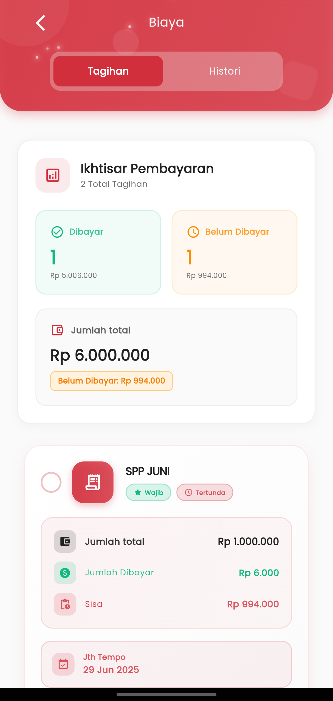

# Tagihan

<figure><figcaption></figcaption></figure>

###

Fitur **Biaya** di aplikasi eSchool Mobile dirancang agar orang tua dapat memantau status pembayaran sekolah anak secara **praktis, transparan, dan real-time**. Semua informasi penting ditampilkan secara ringkas dan mudah dipahami, tanpa perlu membuka laporan manual.

#### Ikhtisar Pembayaran Sekilas

Begitu halaman dibuka, Anda akan langsung melihat:

* **Jumlah Tagihan yang Sudah Dibayar** lengkap dengan total nominal.
* **Jumlah Tagihan yang Belum Dibayar** beserta total kekurangannya.
* Total keseluruhan tagihan siswa.

Warna hijau menandakan status **lunas**, sedangkan warna oranye memperjelas tagihan yang masih **tertunda**.

#### Lihat Detail Setiap Tagihan

Setiap tagihan ditampilkan dalam kartu khusus, berisi:

* Nama tagihan (misalnya: _SPP JUNI_)
* Status tagihan (Wajib, Tertunda)
* Jumlah total tagihan
* Nominal yang sudah dibayar
* Sisa tagihan
* Batas waktu pembayaran (Jatuh Tempo)

Tampilan ini memudahkan Anda untuk langsung mengetahui tagihan mana yang harus segera dibayar, tanpa harus menghitung manual atau bertanya ke sekolah.

***

Jika Anda ingin melihat riwayat pembayaran yang telah diselesaikan sebelumnya, cukup geser ke tab **Histori** di bagian atas.
