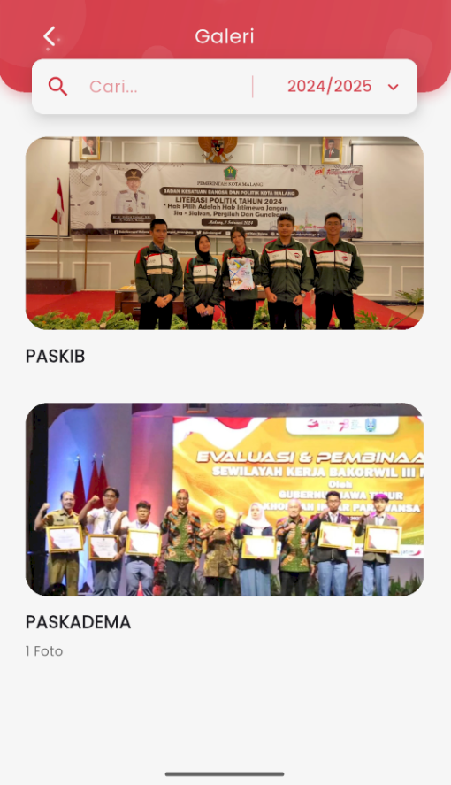

# Galeri

<figure><figcaption></figcaption></figure>

### Halaman Galeri

Halaman **Galeri** di eSchool Mobile menampilkan dokumentasi kegiatan sekolah dalam bentuk foto ataupun video yang tersimpan berdasarkan kategori dan tahun ajaran.

Fitur-fitur utama pada halaman ini:

1. **Pencarian Galeri**\
   Gunakan kolom pencarian untuk mencari dokumentasi kegiatan berdasarkan nama atau kata kunci.
2. **Filter Tahun Ajaran**\
   Pilih tahun ajaran tertentu untuk menampilkan galeri foto dari periode tersebut.
3. **Daftar Album Kegiatan**\
   Setiap kegiatan ditampilkan dalam bentuk kartu dengan:
   * **Judul kegiatan** (misalnya: _PASKIB_, _PASKADEMA_)
   * Thumbnail foto pertama
   * Jumlah foto di dalam album (jika lebih dari satu)
4. **Navigasi ke Detail Album**\
   Ketuk salah satu album untuk melihat semua foto di dalamnya secara lebih lengkap.

***

📌 _Catatan:_ Hanya pengguna tertentu (seperti admin sekolah) yang memiliki akses untuk mengunggah atau mengedit konten galeri.
