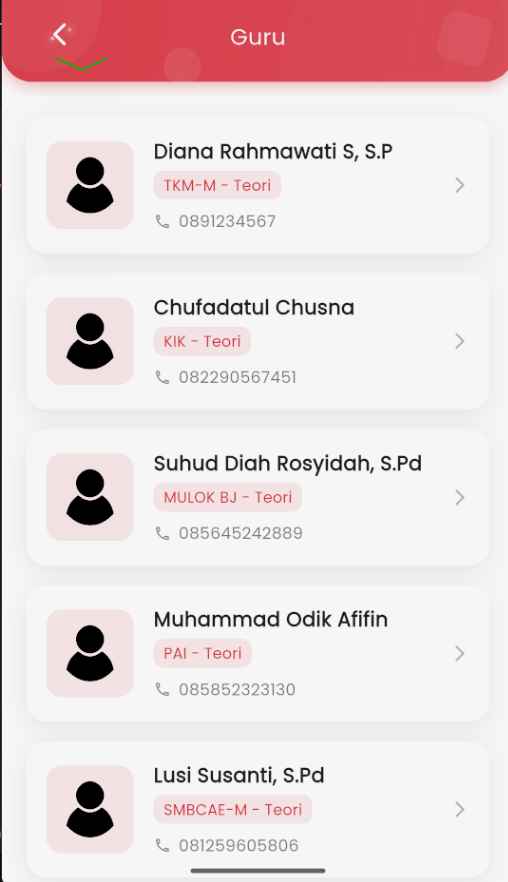
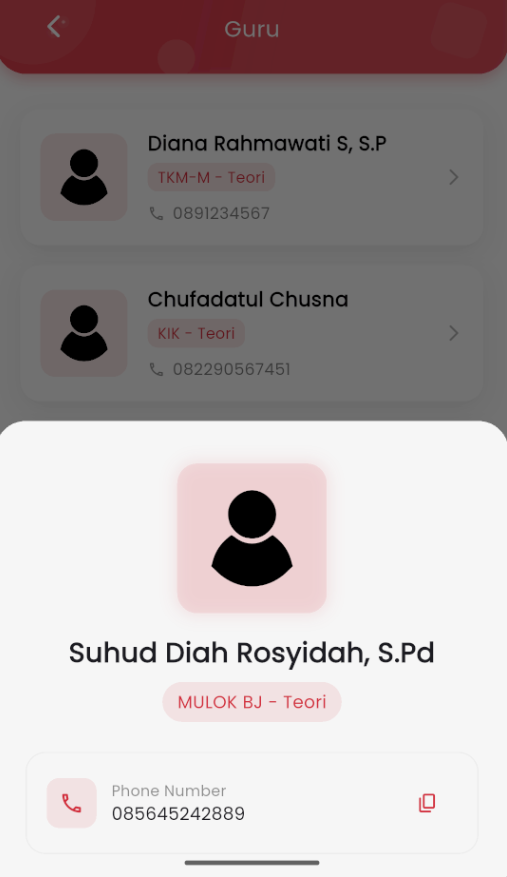

# Guru

<figure><figcaption></figcaption></figure> <figure><figcaption></figcaption></figure>

#### **Halaman Guru – Informasi dan Akses Cepat untuk Orang Tua & Siswa**

Pada halaman **Guru**, pengguna dapat melihat daftar guru yang mengampu pelajaran di sekolah. Setiap entri menampilkan **nama guru**, **mata pelajaran**, **jenis pelajaran** (misal: Teori), dan **nomor telepon yang dapat disalin**. Tampilan dirancang untuk tetap sederhana dan nyaman dibaca baik oleh siswa maupun orang tua.

&#x20;**Fitur Utama:**

* **Daftar Guru**: Ditampilkan dalam bentuk kartu yang informatif, lengkap dengan ikon profil.
* **Mata Pelajaran**: Ditampilkan di bawah nama guru (contoh: _MULOK BJ – Teori_).
* **Nomor Telepon**: Langsung bisa dilihat dan terdapat fitur **copy to clipboard** dengan ikon 📋 agar pengguna dapat menyalin nomor dengan sekali tap.
* **Detail Guru**: Ketika salah satu kartu guru diklik, akan muncul tampilan pop-up (bottom sheet) yang menampilkan ulang informasi guru tersebut dengan lebih fokus dan tetap menyertakan tombol salin untuk nomor.

&#x20;**Kenyamanan dan Aksesibilitas:**

* Orang tua atau siswa bisa langsung menyalin nomor untuk menghubungi guru jika diperlukan, seperti konsultasi pembelajaran, absensi, atau koordinasi akademik lainnya.
* Desain yang clean dan fokus pada keterbacaan agar mudah diakses segala usia.

Halaman ini menjadi jembatan penghubung antara pihak sekolah dan pengguna aplikasi, dengan memberikan transparansi dan akses kontak secara langsung terhadap guru yang bertanggung jawab pada pelajaran tertentu.
