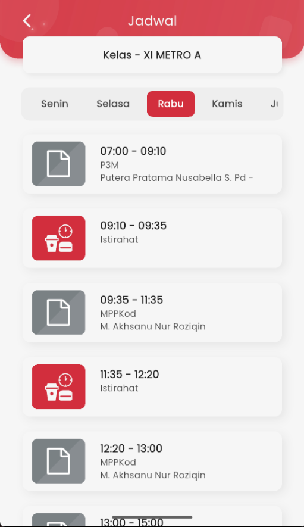

# Jadwal Pelajaran Anak

<figure><figcaption></figcaption></figure>

Melalui halaman **Jadwal**, orang tua/wali dapat memantau kegiatan belajar anak setiap hari. Fitur ini menampilkan susunan pelajaran, waktu, dan nama guru pengajar untuk masing-masing sesi.

#### Tampilan Kelas Anak

Di bagian atas, terdapat label nama kelas anak seperti **"Kelas – XI METRO A"**. Sistem menampilkan data otomatis sesuai anak yang sedang dipantau, sehingga Anda tidak perlu memilih kelas secara manual.

#### Navigasi Hari

Gunakan tab hari (Senin s/d Sabtu) untuk melihat jadwal sesuai hari sekolah. Jadwal akan berubah sesuai pilihan hari, menampilkan semua sesi belajar hari tersebut.

#### Informasi Jadwal

Setiap baris jadwal berisi:

* Jam pelajaran (misalnya: 07:00 – 09:10)
* Nama mata pelajaran (contoh: P3M, MPPKod)
* Nama guru pengajar
* Blok istirahat ditampilkan secara jelas dengan ikon 🍴 untuk memisahkan waktu jeda dari sesi belajar.

Fitur ini membantu orang tua lebih mudah memahami aktivitas belajar anak setiap harinya dan dapat digunakan untuk mendukung kesiapan belajar dari rumah.
