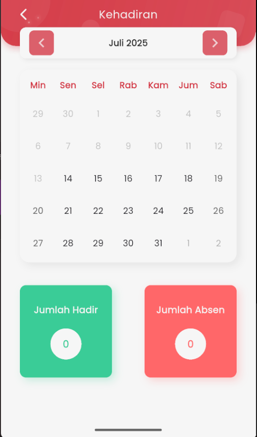

# Kehadiran Anak

<figure><figcaption></figcaption></figure>

Halaman **Kehadiran** pada aplikasi eSchool Mobile untuk wali murid menampilkan ringkasan kehadiran anak dalam format kalender yang intuitif dan mudah dipahami. Fitur ini membantu orang tua untuk memantau kedisiplinan belajar anak secara langsung melalui aplikasi.

#### Navigasi Bulanan

Gunakan ikon panah kanan atau kiri di bagian atas untuk berpindah bulan dan melihat histori kehadiran anak secara lengkap.

#### Tampilan Kalender

Setiap tanggal ditampilkan dalam format kalender bulanan. Status kehadiran anak akan ditandai dengan warna berbeda (jika tersedia), seperti:

* 🟢 **Hadir**
* 🔴 **Absen**
* 🟡 **Izin**
* ⚪️ **Belum Tersedia**

#### Ringkasan Total

Di bagian bawah halaman terdapat dua kotak ringkasan:

* **Jumlah Hadir**: Total hari kehadiran anak di bulan tersebut
* **Jumlah Absen**: Total ketidakhadiran anak

Dengan visual yang sederhana dan informatif, orang tua dapat dengan mudah mengetahui pola kehadiran anak dan mengambil tindakan jika diperlukan.
