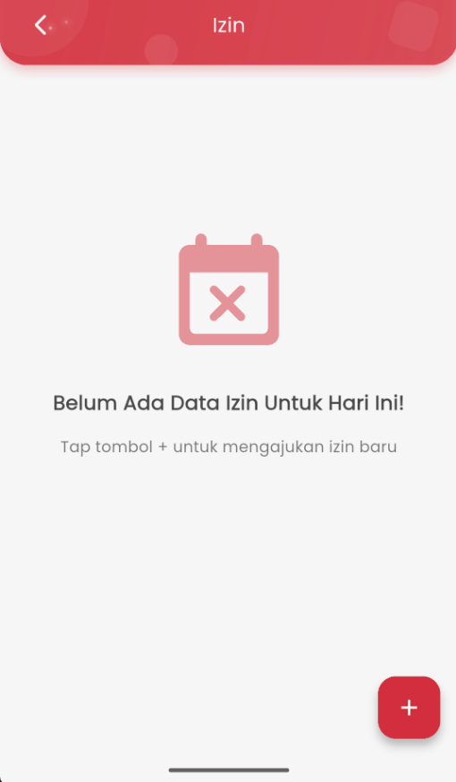
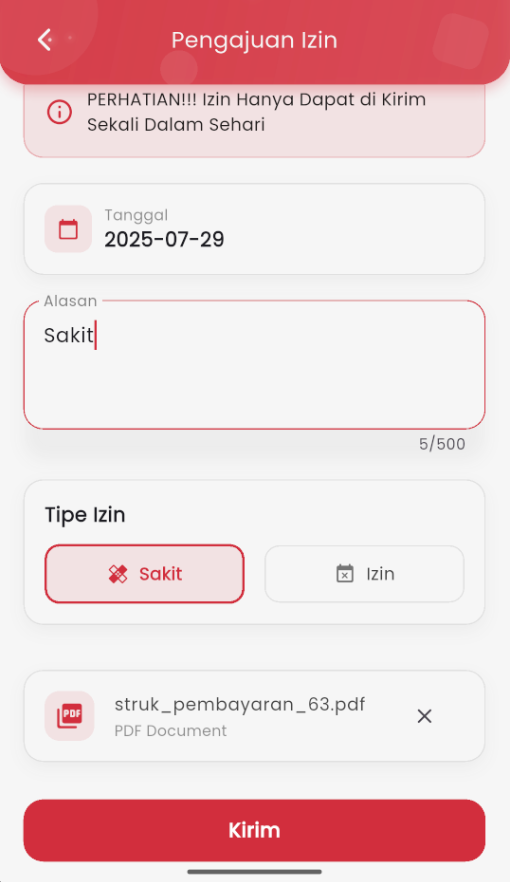
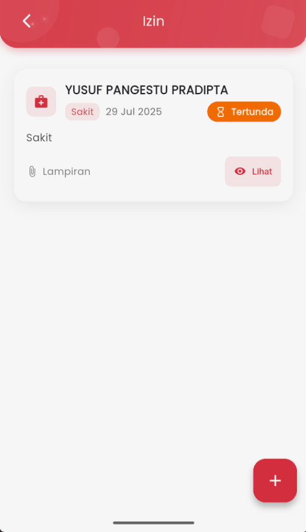

# Mengajukan Izin Kehadiran

<figure><figcaption></figcaption></figure> <figure><figcaption></figcaption></figure> <figure><figcaption></figcaption></figure>

#### Cara Mengajukan Izin:

1. Buka menu **Izin** dari tampilan utama aplikasi.
2. Jika belum ada pengajuan izin hari ini, akan muncul pesan:\
   &#xNAN;**"Belum Ada Data Izin Untuk Hari Ini!"**
3. Tekan tombol **( + )** di pojok kanan bawah untuk mengajukan izin baru.
4. Isi formulir pengajuan izin:
   * **Tanggal**: Pilih tanggal izin.
   * **Alasan**: Tulis alasan tidak masuk (contoh: Sakit).
   * **Tipe Izin**: Pilih salah satu: `Sakit` atau `Izin`.
   * **Lampiran** (opsional tapi disarankan): Unggah file pendukung seperti surat dokter atau dokumen lain (PDF/JPG).
5. Setelah semua data terisi, tekan tombol **Kirim**.

📌 _Catatan:_ Izin hanya dapat diajukan **satu kali dalam sehari**.

***

#### Setelah Izin Diajukan:

* Status pengajuan akan muncul di daftar izin, misalnya:
  * **Tipe**: Sakit
  * **Status**: Tertunda (menunggu persetujuan)
  * **Tanggal & alasan izin**
  * **Lampiran**: Dapat dilihat kembali melalui tombol **Lihat**

***

Fitur ini mempermudah proses pemberitahuan izin secara digital, serta membantu pihak sekolah dalam memverifikasi data secara langsung.

Jika terjadi kendala saat mengajukan izin, pastikan koneksi internet stabil dan pastikan file lampiran tidak melebihi batas ukuran.
