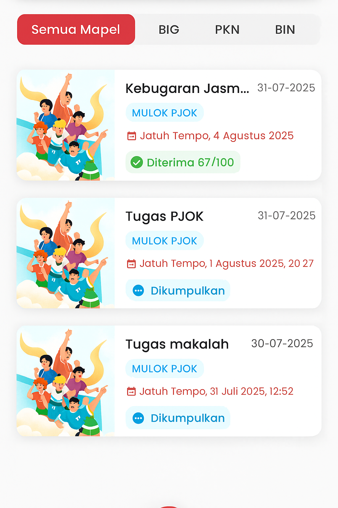

# Pengumpulan Tugas

<figure><figcaption></figcaption></figure>

#### **Halaman Tugas (Wali Murid)**

Halaman **Tugas** dirancang untuk memberikan informasi lengkap kepada orang tua atau wali siswa mengenai semua aktivitas tugas yang telah dikerjakan oleh anaknya. Tampilan ini terbagi menjadi dua bagian utama: **Ditugaskan** dan **Dikumpulkan**, yang masing-masing menunjukkan status terkini dari tugas siswa.

**📌 Fitur Inti:**

* **Tab Ditugaskan**: Menampilkan daftar tugas yang masih harus dikerjakan oleh siswa. Informasi ini membantu wali mengetahui tanggung jawab anak yang belum diselesaikan.
* **Tab Dikumpulkan**: Menampilkan daftar tugas yang sudah dikirim oleh siswa. Beberapa tugas juga disertai **status penilaian** seperti:
  * ✅ _Diterima 67/100_: Artinya tugas sudah diperiksa guru dan dinilai.
  * 📤 _Dikumpulkan_: Artinya siswa sudah mengirim tugas, namun belum dinilai oleh guru.
* **Filter Mapel**: Orang tua bisa melihat tugas berdasarkan mata pelajaran seperti Bahasa Inggris (BIG), PKn, Bahasa Indonesia (BIN), dan lainnya. Fitur ini memudahkan pemantauan khusus untuk mata pelajaran tertentu.

**📅 Informasi Tambahan di Setiap Tugas:**

* **Judul Tugas & Mata Pelajaran** ditampilkan secara jelas.
* **Tanggal Pengumpulan (Deadline)** ditampilkan lengkap dengan jam agar wali bisa mengingatkan anak tepat waktu.
* **Ilustrasi Visual** membantu membedakan tugas satu dengan lainnya dan membuat antarmuka lebih informatif.

***

#### 💡 **Tujuan Halaman Ini**

Fitur ini memberikan **transparansi penuh** kepada wali murid terkait perkembangan akademik anak, mendorong kolaborasi antara sekolah dan keluarga dalam mendampingi siswa. Orang tua tidak hanya bisa memantau, tetapi juga mendukung anak untuk menyelesaikan tugas tepat waktu dan mengevaluasi hasil belajarnya secara berkala.
