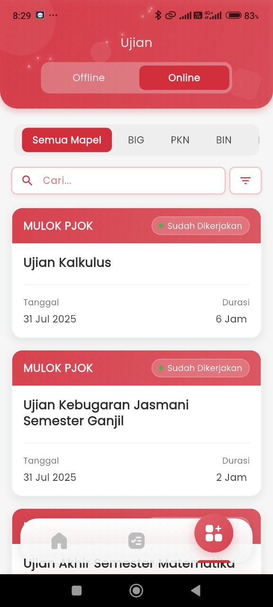
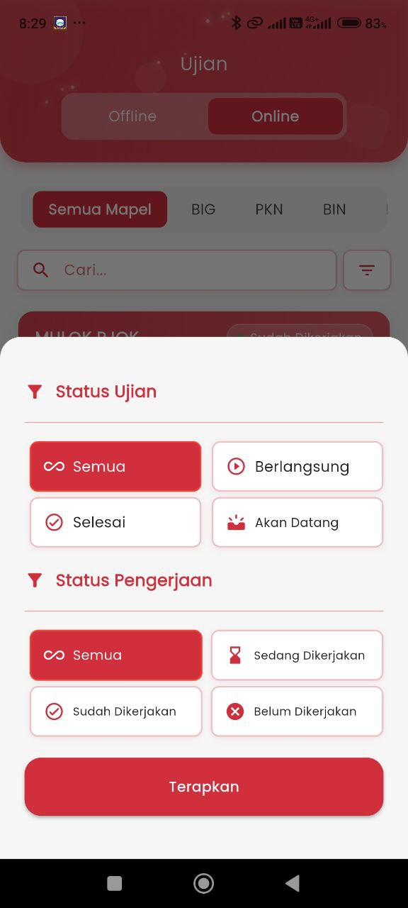

# Ujian Online

<figure><figcaption></figcaption></figure> <figure><figcaption></figcaption></figure>

#### **Ujian Online - Pantauan Orang Tua**

Fitur ini dirancang untuk memberikan kemudahan bagi orang tua dalam memantau aktivitas ujian anak mereka secara daring. Tampilan ujian dibagi menjadi dua kategori utama: **Offline** dan **Online**. Dalam konteks ini, pengguna berada pada tab **Online**.

&#x20;**Filter dan Navigasi**

Di bagian atas, tersedia beberapa kontrol penting untuk menyaring dan mencari ujian:

* **Pilih Mapel**: Menyediakan filter berdasarkan mata pelajaran (contoh: BIG, PKN, BIN).
* **Kolom Pencarian**: Memudahkan pencarian ujian berdasarkan nama atau kata kunci tertentu.
* **Filter Status** (gambar kedua): Memungkinkan pengguna menyaring berdasarkan:
  * **Status Ujian**: Semua, Berlangsung, Selesai, Akan Datang.
  * **Status Pengerjaan**: Semua, Sedang Dikerjakan, Sudah Dikerjakan, Belum Dikerjakan.

&#x20;**Daftar Ujian Online**

Setiap ujian ditampilkan dalam kartu informasi yang berisi:

* **Nama Ujian**: Seperti _Ujian Kalkulus_ atau _Ujian Kebugaran Jasmani Semester Ganjil_.
* **Kategori Mapel**: Dicantumkan di bagian atas kartu (contoh: MULOK PJOK).
* **Status Pengerjaan**: Ditunjukkan oleh badge seperti **Sudah Dikerjakan** (dengan indikator hijau).
* **Tanggal Ujian**: Informasi kapan ujian dilaksanakan.
* **Durasi Ujian**: Lama waktu ujian (misal: 6 Jam atau 2 Jam).

&#x20;**Tujuan Fitur**

Dengan fitur ini, orang tua dapat:

* Memantau **riwayat ujian daring** anak.
* Mengetahui **status pengerjaan** secara real-time.
* Melihat **mata pelajaran dan tanggal pelaksanaan** dengan cepat.
* Menggunakan filter untuk fokus pada ujian yang sedang berlangsung, belum dikerjakan, atau sudah selesai.
