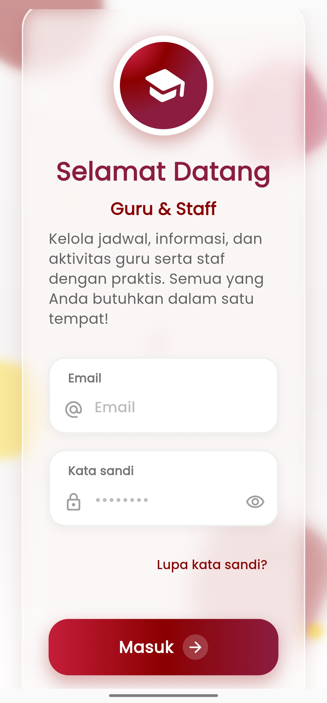
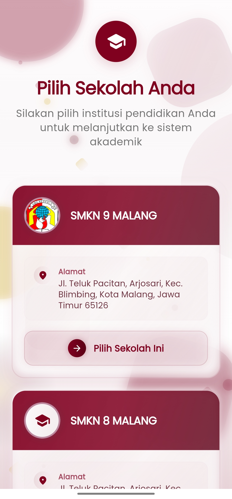

# Login

## Cara Login ke Aplikasi eSchool Mobile

<figure><figcaption>
<em>Tampilan Halaman Login eSchool</em>
</figcaption></figure> <figure><figcaption></figcaption></figure>

Untuk menggunakan aplikasi **eSchool Mobile**, pastikan Anda telah memiliki akun resmi yang didaftarkan oleh pihak sekolah atau admin eSchool.

#### 1. Unduh Aplikasi

Unduh aplikasi **eSchool Mobile** melalui:

* [Google Play Store](https://play.google.com/store/apps/details?id=id.ac.eschool.GuruStaff.android\&hl=id) untuk perangkat Android
* [Apple App Store](https://play.google.com/store/apps/details?id=id.ac.eschool.GuruStaff.android\&hl=id) untuk perangkat iOS

Cari dengan kata kunci: **"eSchool Mobile"**

#### 2. Login dengan Akun Resmi

Setelah aplikasi terinstal:

1. Buka aplikasi eSchool Mobile
2. Tekan tombol **"Login"** di halaman awal
3. Masukkan **username dan password** yang Anda dapatkan dari sekolah
4. Jika ini adalah login pertama, Anda mungkin akan diminta untuk:
   * Mengubah password
   * Memverifikasi identitas atau data dasar akun

> Akun login hanya dapat digunakan jika telah **diaktifkan oleh admin sekolah atau operator eSchool**.

#### 3. Pilih Sekolah Anda

Jika akun Anda terhubung dengan **lebih dari satu sekolah** (misalnya sebagai orangtua dengan anak di beberapa sekolah, atau guru dengan lebih dari satu penugasan), maka setelah login Anda akan melihat halaman **"Pilih Sekolah"**.

* Pilih nama sekolah yang ingin Anda akses saat ini
* Anda bisa **berpindah sekolah** kapan saja melalui menu profil atau pengaturan
* Pastikan Anda memilih sekolah yang sesuai untuk melihat data, kelas, dan aktivitas yang benar

***

#### Kendala Login?

Jika Anda mengalami masalah saat login, berikut langkah yang dapat dilakukan:

* **Lupa Password?**\
  Gunakan fitur **"Lupa Password"** di halaman login aplikasi.\
  Ikuti petunjuk reset yang akan dikirimkan melalui **email** yang terdaftar.
* **Tidak Bisa Akses Akun?**\
  Hubungi langsung:
  * **Admin sekolah** (untuk cek status akun Anda)
  * Atau hubungi **Tim Support eSchool** melalui menu [**Bantuan**](https://www.eschool.ac.id/#contact-us)&#x20;
