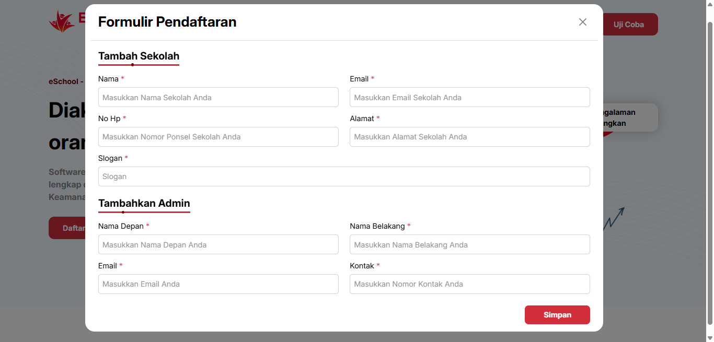

# Pendaftaran

## Cara Mendaftar dan Mengakses eSchool Mobile

**eSchool Mobile** hanya dapat digunakan oleh sekolah yang telah **berlangganan resmi** melalui tim eSchool. Pengguna tidak dapat mendaftar secara mandiri melalui aplikasi, karena proses aktivasi dilakukan secara terpusat oleh tim eSchool.

### Langkah-langkah Pendaftaran Sekolah:

1.  Sekolah melakukan pendaftaran di halaman website eSchool Siakad dengan klik tombol "Daftarkan Sekolah Anda".

    <figure><figcaption>
<em>Tampilan Halaman Awal – Klik tombol 'Daftarkan Sekolah Anda'</em>
</figcaption></figure>
2.  Isi formulir pendaftaran sekolah dan admin yang muncul setelah tombol ditekan.

    <figure><figcaption>
<em>Isi data sekolah dan admin utama dengan lengkap dan benar</em>
</figcaption></figure>

3\. Setelah aktivasi, admin eSchool akan:

* Membuat akun admin sekolah (untuk kepala sekolah/operator).
* Menyediakan akses login awal.

4. Admin sekolah kemudian dapat membuat dan mengelola akun pengguna lain seperti:
   * Guru
   * Siswa
   * Orang tua/wali murid
5. Akun pengguna akan dikirimkan via email atau media komunikasi resmi dari pihak sekolah.

***

## Akses ke Aplikasi Mobile

* Setelah akun dibuat oleh admin sekolah, **guru, siswa, dan orang tua** dapat **mengunduh aplikasi eSchool Mobile** dari Play Store/App Store.
* Login dilakukan menggunakan **akun resmi yang dibagikan oleh sekolah**.
* Setelah login pertama berhasil, pengguna dapat langsung mengakses fitur-fitur sesuai dengan perannya masing-masing.

***

## Penting Diketahui

* **Tidak tersedia pendaftaran mandiri** bagi individu (guru/siswa/orangtua) melalui aplikasi.
* Proses penggunaan eSchool selalu **dimulai dari sekolah**, bukan perorangan.
* Jika Anda adalah pengguna (guru, orang tua, atau siswa) yang ingin menggunakan eSchool Mobile, mohon arahkan pihak sekolah Anda untuk **menghubungi tim eSchool** guna memulai proses pendaftaran resmi.

\
\
Jika Anda membutuhkan bantuan lebih lanjut, hubungi kami melalui [halaman Bantuan eSchool](https://www.eschool.ac.id/#contact-us).

***
