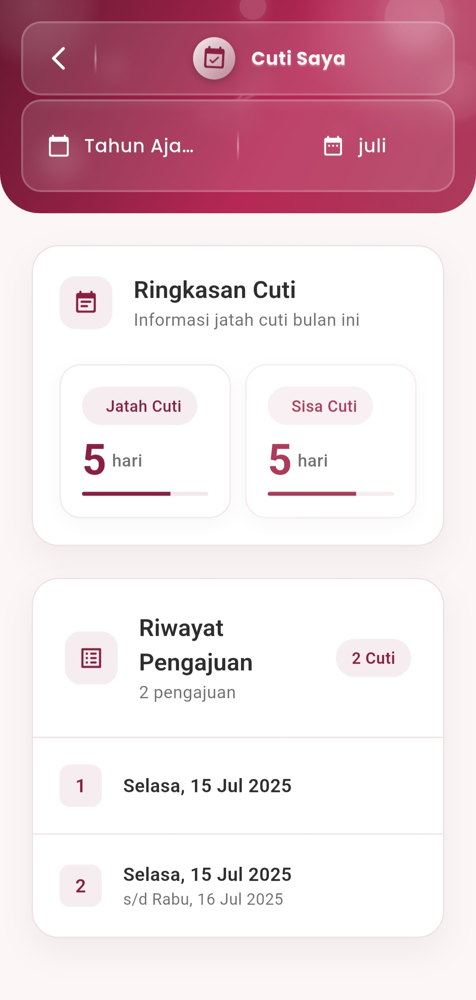

# Riwayat Cuti

**Cuti Saya**

#### Pantau Hak dan Riwayat Cuti Anda secara Real-Time & Transparan

Menu **Cuti Saya** memungkinkan pengguna untuk melihat rekap jatah cuti dan seluruh histori pengajuan cuti dalam satu tampilan yang rapi dan intuitif.

<figure><figcaption></figcaption></figure>

#### **Fitur-Fitur Utama**

**Ringkasan Jatah Cuti Bulanan**

Bagian ringkasan cuti menampilkan dua informasi utama:

* **Jatah Cuti**: Total alokasi cuti untuk bulan berjalan
* **Sisa Cuti**: Hari cuti yang belum digunakan

Indikator visual bar horizontal ditampilkan di bawahnya untuk memberikan gambaran progres pemakaian cuti secara cepat.

**Riwayat Pengajuan Cuti**

Semua data pengajuan cuti terdokumentasi dengan baik dan ditampilkan berdasarkan urutan waktu:

* Nomor pengajuan otomatis
* Tanggal pengajuan cuti (satu hari atau rentang hari)
* Informasi pengajuan ditampilkan ringkas namun informatif

Contoh:

> **1. Selasa, 15 Juli 2025**\
> **2. Selasa, 15 Juli 2025 – Rabu, 16 Juli 2025**

Total jumlah cuti yang diajukan dalam satu bulan juga dirangkum dalam label kecil seperti **“2 Cuti”**.

#### Filter Berdasarkan Tahun dan Bulan

Pengguna dapat memfilter data riwayat berdasarkan:

* **Tahun Ajaran**
* **Bulan**

Fitur ini sangat membantu untuk melakukan pelacakan data tahunan, pengecekan sisa cuti antar bulan, dan kepatuhan terhadap kebijakan perusahaan.

***

Jika Anda membutuhkan bantuan lebih lanjut, hubungi kami melalui [halaman Bantuan eSchool](https://www.eschool.ac.id/#contact-us).
