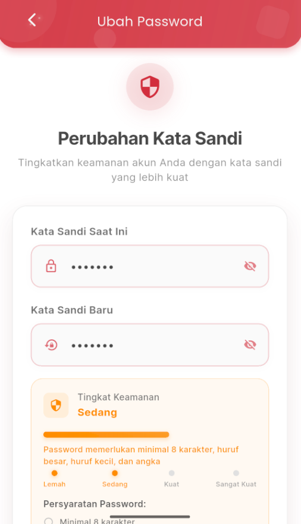
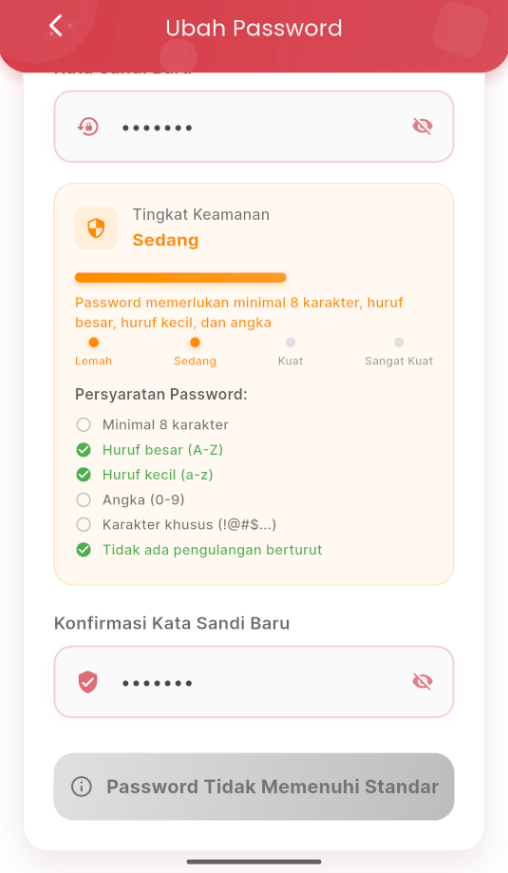

# Ubah Password

<figure><figcaption></figcaption></figure> <figure><figcaption></figcaption></figure>

### Ubah Password

Fitur **Ubah Password** memungkinkan pengguna untuk meningkatkan keamanan akun dengan membuat password baru yang lebih kuat.

1. Buka halaman **Ubah Password** melalui menu pengaturan.
2. Masukkan **kata sandi saat ini** di kolom pertama.
3. Masukkan **kata sandi baru** yang ingin digunakan.
4. Sistem akan secara otomatis menilai **tingkat keamanan** password baru Anda (Lemah, Sedang, Kuat, atau Sangat Kuat).
5. Untuk melanjutkan, password baru harus memenuhi persyaratan berikut:
   * Minimal 8 karakter
   * Mengandung huruf **besar (A–Z)**
   * Mengandung huruf **kecil (a–z)**
   * **(Opsional, tapi direkomendasikan)**: Angka (0–9) dan karakter khusus (!@#$...)
   * Tidak mengandung pengulangan karakter yang berurutan (misal: aaa, 123)
6. Masukkan kembali **konfirmasi kata sandi baru** untuk memastikan tidak ada kesalahan ketik.
7. Jika password belum memenuhi standar, tombol simpan akan nonaktif dan pesan peringatan akan muncul: **“Password Tidak Memenuhi Standar”**.
8. Jika password memenuhi standar,tombol simpan akan aktif dan pesan akan muncul "Perbarui Kata Sandi"

***

💡 _Tips Keamanan:_\
Gunakan kombinasi huruf besar, huruf kecil, angka, dan simbol untuk membuat password yang lebih kuat dan sulit ditebak.
